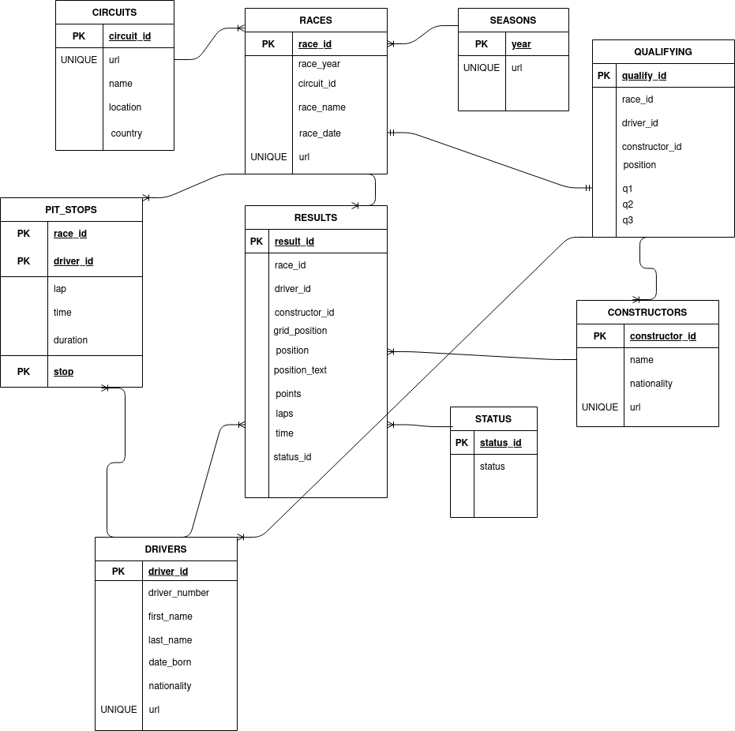

# SGBD Project
Some scripts that manipulate an F1 database. Data is taken from [here](https://ergast.com/mrd/db/).

## Structure
In the [data/](./data/) folder there are the `.csv` files that contain the actual database itself. In [scripts/](./scripts/) the [reader.py](./scripts/reader.py) script parses the csv files and outputs the schema and SQL statements(Oracle compatible) to be able to construct the database itself. The `.sql` files in [scripts/](./scripts/) are sample outputs of [reader.py](./scripts/reader.py)

In the [sql/](./sql/) folder there are the scripts that implement the project requirements.

## Conceptual Design of the Database

