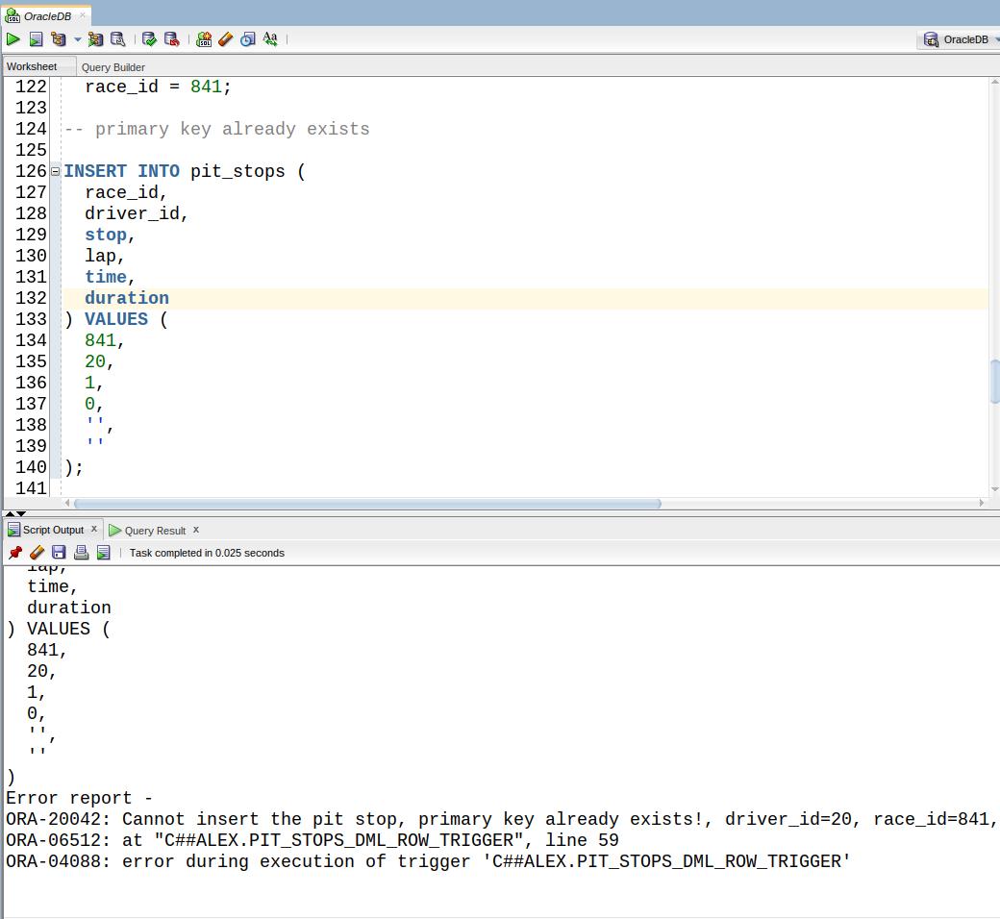

\newpage

# Baza de date
Am ales să creez o bază de date care conține date reprezentând rezultate din F1. Astfel se pot realiza
statistici relativ complexe, potrivite pentru proiect.

Am preluat datele de [aici](https://ergast.com/mrd/db/) în format `CSV`, și le-am convertit în script-uri
`SQL` folosind `Python`.

# Diagrama Entitate/Relație


\newpage

# Diagrama Conceptuală


# Cerința 4
```sql
CREATE TABLE seasons(
  year NUMBER(11) NOT NULL,
  url VARCHAR2(255) NOT NULL,
  CONSTRAINT seasons_uk UNIQUE (url),
  CONSTRAINT seasons_pk PRIMARY KEY (year)
);

CREATE TABLE circuits(
  circuit_id NUMBER(11) NOT NULL,
  name VARCHAR2(255) NOT NULL,
  location VARCHAR2(255) DEFAULT NULL,
  country VARCHAR2(255) DEFAULT NULL,
  url VARCHAR2(255) NOT NULL,
  CONSTRAINT circuits_uk UNIQUE (url),
  CONSTRAINT circuits_pk PRIMARY KEY (circuit_id)
);

CREATE TABLE races(
  race_id NUMBER(11) NOT NULL,
  race_year NUMBER(11) NOT NULL,
  circuit_id NUMBER(11) NOT NULL,
  race_name VARCHAR2(255) NOT NULL,
  race_date DATE NOT NULL,
  url VARCHAR2(255) DEFAULT NULL,
  CONSTRAINT races_uk UNIQUE (url),
  CONSTRAINT races_pk PRIMARY KEY (race_id)
);

CREATE TABLE drivers(
  driver_id NUMBER(11) NOT NULL,
  driver_number NUMBER(11),
  first_name VARCHAR2(255) NOT NULL,
  last_name VARCHAR2(255) NOT NULL,
  date_born DATE DEFAULT NULL,
  nationality VARCHAR2(255) DEFAULT NULL,
  url VARCHAR2(255) DEFAULT NULL,
  CONSTRAINT drivers_uk UNIQUE (url),
  CONSTRAINT drivers_pk UNIQUE (driver_id)
);

CREATE TABLE constructors(
  constructor_id NUMBER(11) NOT NULL,
  name VARCHAR2(255) NOT NULL,
  nationality VARCHAR2(255) DEFAULT NULL,
  url VARCHAR2(255) NOT NULL,
  CONSTRAINT constructors_uk UNIQUE (url),
  CONSTRAINT constructors_pk UNIQUE (constructor_id)
);

CREATE TABLE status(
  status_id NUMBER(11) NOT NULL,
  status VARCHAR2(255) NOT NULL,
  CONSTRAINT status_pk PRIMARY KEY (status_id)
);

CREATE TABLE results(
  result_id NUMBER(11) NOT NULL,
  race_id NUMBER(11) NOT NULL,
  driver_id NUMBER(11) NOT NULL,
  constructor_id NUMBER(11) NOT NULL,
  grid_position NUMBER(11) NOT NULL,
  position NUMBER(11) DEFAULT NULL,
  position_text VARCHAR2(255) DEFAULT NULL,
  points NUMBER(4, 2) DEFAULT 0,
  laps NUMBER(11) DEFAULT 0,
  time VARCHAR2(255) DEFAULT NULL,
  status_id NUMBER(11) NOT NULL,
  CONSTRAINT results_pk PRIMARY KEY (result_id)
);

CREATE TABLE qualifying(
  qualify_id NUMBER(11) NOT NULL,
  race_id NUMBER(11) NOT NULL,
  driver_id NUMBER(11) NOT NULL,
  constructor_id NUMBER(11) NOT NULL,
  position NUMBER(11) DEFAULT NULL,
  q1 VARCHAR2(255) DEFAULT NULL,
  q2 VARCHAR2(255) DEFAULT NULL,
  q3 VARCHAR2(255) DEFAULT NULL,
  CONSTRAINT qualifying_pk PRIMARY KEY (qualify_id)
);

CREATE TABLE pit_stops(
  race_id NUMBER(11) NOT NULL,
  driver_id NUMBER(11) NOT NULL,
  stop NUMBER(11) NOT NULL,
  lap NUMBER(11) DEFAULT NULL,
  time VARCHAR2(255) DEFAULT NULL,
  duration VARCHAR2(255) DEFAULT NULL,
  CONSTRAINT pit_stops_pk PRIMARY KEY (race_id, driver_id, stop)
);
```

\newpage

## Demo


# Cerința 5
Pentru fiecare document `CSV` am generat script-uri SQL care îmi generează baza de date. Cum sunt foarte multe date
(unele tabele având peste 8.000 de linii) am inclus în proiect o arhivă cu codul SQL pentru a insera toate datele.

## Demo


Am pus aici demonstrația pentru tabelul `seasons`, având mai puține date.

\newpage

# Cerința 6
Aici am implementat o procedura care întoarce toți piloții care au fost nevoiti să se retragă dintr-o cursă într-un
anumit sezon. Am folosit tipul `VARRAY` pentru a stoca numele piloților și echipa cu care au participat.
```sql
CREATE OR REPLACE PROCEDURE p_get_retirements_for_season (
  v_year seasons.year%TYPE
) IS

  TYPE type_map_races IS
    TABLE OF VARCHAR2(512) INDEX BY VARCHAR2(256);

  v_races    type_map_races;
  v_index    VARCHAR2(256);
  v_season   NUMBER(11);
  v_count    NUMBER := 0;

  CURSOR c_iter_grands_prix IS
    SELECT
      r.race_name AS race,
      d.first_name
      || ' '
      || d.last_name
      || '('
      || s.status
      || ')' AS driver
    FROM
      results   res
      JOIN races     r ON ( res.race_id = r.race_id )
      JOIN drivers   d ON ( res.driver_id = d.driver_id )
      JOIN status    s ON ( res.status_id = s.status_id )
    WHERE
      r.race_year = v_year
      AND res.position IS NULL
      AND res.position_text = 'R'
    ORDER BY
      r.race_date;

BEGIN
  BEGIN
    SELECT
      year
    INTO v_season
    FROM
      seasons
    WHERE
      year = v_year;

  EXCEPTION
    WHEN no_data_found THEN
      dbms_output.put_line('No "'
                           || v_year
                           || '" season!');
      RETURN;
    WHEN OTHERS THEN
      raise_application_error(exception_seq.nextval, 'Unknown error occured when fetching info from "seasons"');
  END;

  FOR i IN c_iter_grands_prix LOOP
    IF v_races.EXISTS(i.race) THEN
      v_races(i.race) := v_races(i.race)
                       || chr(10)
                       || '  '
                       || i.driver;
    ELSE
      v_races(i.race) := i.driver;
    END IF;
  END LOOP;

  v_index := v_races.first;
  WHILE v_index IS NOT NULL LOOP
    dbms_output.put_line(v_index
                         || ':'
                         || chr(10)
                         || '  '
                         || v_races(v_index));

    v_count := v_count + 1;
    v_index := v_races.next(v_index);
  END LOOP;

  IF v_count = 0 THEN
    dbms_output.put_line('No retirements in season ' || v_year);
  END IF;

END;
/
```

```sql
BEGIN
  p_get_retirements_for_season(2020);
  dbms_output.put_line('-----------------------');
  p_get_retirements_for_season(1980);
  dbms_output.put_line('-----------------------');
  p_get_retirements_for_season(2021); --> No retirements in season 2021
  dbms_output.put_line('-----------------------');
  p_get_retirements_for_season(2022); --> No "2022" season
END;
/
```

## Demo


\newpage

# Cerința 7
Pentru această cerință am ales să implementez o procedură care să întarcă clasamentul pentru un sezon. Am folosit un
cursor care întoarce numele, echipa și câte puncte a obținut un pilot în fiecare cursă dintr-un sezon dat,
după care în funcție stochez într-un table indexat după nume și echipă suma punctelor pentru a putea sorta
în cele din urmă după numărul de puncte descrescător, cu `CAST` și `MULTISET`.

```sql
CREATE TYPE sortable_t IS object(
    driver VARCHAR2(1024),
    points NUMBER(11, 2)
);

CREATE TYPE sortable_table_t IS TABLE OF sortable_t;

CREATE OR REPLACE PROCEDURE p_get_driver_standings_for_season (
  v_year seasons.year%TYPE
) IS

  TYPE type_map_drivers IS
    TABLE OF NUMBER(11, 2) INDEX BY VARCHAR2(1024);

  v_drivers   type_map_drivers;
  v_index     VARCHAR2(1024);
  v_sorted    sortable_table_t := sortable_table_t();

  CURSOR c_results IS
    SELECT
      d.first_name
      || ' '
      || d.last_name
      || '('
      || c.name
      || ')' AS driver,
      res.points AS points
    FROM
      results        res
      JOIN races          r ON ( r.race_id = res.race_id )
      JOIN drivers        d ON ( d.driver_id = res.driver_id )
      JOIN constructors   c ON ( c.constructor_id = res.constructor_id )
      JOIN seasons        s ON ( s.year = EXTRACT(YEAR FROM r.race_date) )
    WHERE
      r.race_year = v_year
    ORDER BY
      res.points DESC;

BEGIN
  FOR i IN c_results LOOP
    IF v_drivers.EXISTS(i.driver) THEN
      v_drivers(i.driver) := v_drivers(i.driver) + i.points;
    ELSE
      v_drivers(i.driver) := i.points;
    END IF;
  END LOOP;

  v_index := v_drivers.first;
  WHILE v_index IS NOT NULL LOOP
    v_sorted.extend(1);
    v_sorted(v_sorted.last) := NEW sortable_t(v_index, v_drivers(v_index));

    v_index := v_drivers.next(v_index);
  END LOOP;

  -- Sort results stored in v_drivers
  SELECT
    CAST(MULTISET(
      SELECT
        *
      FROM
        TABLE(v_sorted)
      ORDER BY
        2 DESC
    ) AS sortable_table_t)
  INTO v_sorted
  FROM
    dual;

  FOR j IN v_sorted.first..v_sorted.last LOOP
    dbms_output.put_line(v_sorted(j).driver
                        || ': '
                        || v_sorted(j).points
                        || CASE v_sorted(j).points WHEN 1 THEN ' point' ELSE ' points' END);
  END LOOP;

-- Only exception that can occur is when there are no results for the given season
EXCEPTION
  WHEN others THEN
    RAISE_APPLICATION_ERROR(exception_seq.nextval, 'No data found for season "' || v_year || '"');
END;
/
```

```sql
BEGIN
  p_get_driver_standings_for_season(2020);
  p_get_driver_standings_for_season(1949); --> "No data found for season ..."
END;
/
```

## Demo


\newpage

# Cerința 8
Am ales să implementez o procedură care întoarce istoricul unul pilot, adică la ce echipe a fost, câte puncte a
acumulat și pe ce loc s-a clasat în campionat, pentru fiecare sezon în care a participat. Procdura se folosește
de tabelele `results`, `races` și `constructors`, și de o funcție care întoarce pe ce loc s-a clasat un pilot dat
într-un sezon dat folosind funcția "fereastră" `ROW_NUMBER() OVER (...)`.

```sql
CREATE OR REPLACE FUNCTION f_get_wdc_place (
  v_driver_id   drivers.driver_id%TYPE,
  v_season      seasons.year%TYPE
) RETURN NUMBER IS
  v_place NUMBER := 0;
BEGIN
  SELECT
    place
  INTO v_place
  FROM
    (
      SELECT
        res.driver_id AS driver,
        SUM(res.points) AS points,
        ROW_NUMBER() OVER(
          ORDER BY
            SUM(res.points) DESC
        ) AS place
      FROM
        results   res
        JOIN races     r ON ( r.race_id = res.race_id )
        JOIN seasons   s ON ( s.year = EXTRACT(YEAR FROM r.race_date) )
      WHERE
        s.year = v_season
      GROUP BY
        res.driver_id
    ) aux
  WHERE
    aux.driver = v_driver_id;

  RETURN v_place;
EXCEPTION
  WHEN no_data_found THEN
    raise_application_error(exception_seq.nextval, 'There is no driver with id='
                                                   || v_driver_id
                                                   || ' that participated in season '
                                                   || v_season);
  WHEN too_many_rows THEN
    raise_application_error(exception_seq.nextval, 'Fetching driver standings yielded more than one row for id='
                                                   || v_driver_id
                                                   || ', season='
                                                   || v_season);
END;
/

CREATE OR REPLACE PROCEDURE p_get_driver_stats (
  v_first_name   drivers.first_name%TYPE,
  v_last_name    drivers.last_name%TYPE
) IS

  v_driver_id drivers.driver_id%TYPE;

  CURSOR c_results (
    v_id drivers.driver_id%TYPE
  ) IS
  SELECT
    c.name AS team,
    EXTRACT(YEAR FROM r.race_date) AS season,
    SUM(res.points) AS points
  FROM
    results        res
    JOIN constructors   c ON ( c.constructor_id = res.constructor_id )
    JOIN races          r ON ( r.race_id = res.race_id )
  WHERE
    res.driver_id = v_id
  GROUP BY
    c.name,
    EXTRACT(YEAR FROM r.race_date)
  ORDER BY
    2;

BEGIN
  BEGIN
    SELECT
      driver_id
    INTO v_driver_id
    FROM
      drivers
    WHERE
      lower(first_name) = lower(v_first_name)
      AND lower(last_name) = lower(v_last_name);

  EXCEPTION
    WHEN no_data_found THEN
      raise_application_error(exception_seq.nextval, 'There is no driver named "'
                                                     || v_first_name
                                                     || ' '
                                                     || v_last_name
                                                     || '"');
    -- this one never happends with the current data, but putting it here just in case
    WHEN too_many_rows THEN
      raise_application_error(exception_seq.nextval, 'Weird, there are many drivers named "'
                                                     || v_first_name
                                                     || ' '
                                                     || v_last_name
                                                     || '"');
  END;

  FOR i IN c_results(v_driver_id) LOOP
    dbms_output.put_line(v_first_name
                         || ' '
                         || v_last_name
                         || '('
                         || i.team
                         || '), season: '
                         || i.season
                         || ', points: '
                         || i.points
                         || ', WDC place: '
                         || f_get_wdc_place(v_driver_id, i.season));
  END LOOP;

END;
/
```

```sql
BEGIN
  p_get_driver_stats('Lewis', 'Hamilton');
  p_get_driver_stats('A', 'B'); --> no driver found
END;
/
```

## Demo


\newpage

# Cerința 9
La cerința 9 am implementat o procedură care întoarce clasamentele din fiecare cursă dintr-un sezon, fiecare pilot,
echipă, pe ce poziție a început cursa, pe ce poziție a terminat(dacă a terminat), nr. de puncte și statusul.
Procedura se folosește de tabelele `results`, `races`, `drivers`, `constructors` și `status`;

```sql
CREATE OR REPLACE PROCEDURE p_get_results_for_season (
  v_year seasons.year%TYPE
) IS

  TYPE info IS RECORD (
    driver     VARCHAR2(512),
    team       constructors.name%TYPE,
    started    results.grid_position%TYPE,
    finished   results.position_text%TYPE,
    points     results.points%TYPE,
    status     VARCHAR2(255)
  );

  TYPE type_vec_info IS
    VARRAY(50) OF info;

  TYPE type_map_gp IS
    TABLE OF type_vec_info INDEX BY VARCHAR2(255);

  v_gp      type_map_gp;
  v_index   VARCHAR2(255);

  CURSOR c_results IS
    SELECT
      r.race_name         AS race,
      d.first_name
      || ' '
      || d.last_name AS driver,
      c.name              AS team,
      res.grid_position   AS started,
      decode(res.position, NULL, res.position_text, res.position) AS finished,
      res.points          AS points,
      s.status            AS status
    FROM
      results        res
      JOIN races          r ON ( res.race_id = r.race_id )
      JOIN drivers        d ON ( d.driver_id = res.driver_id )
      JOIN constructors   c ON ( c.constructor_id = res.constructor_id )
      JOIN status         s ON ( s.status_id = res.status_id )
    WHERE
      r.race_year = v_year
    ORDER BY
      1,
      6 DESC;

BEGIN
  FOR i IN c_results LOOP
    IF NOT v_gp.EXISTS(i.race) THEN
      v_gp(i.race) := type_vec_info();
    END IF;

    v_gp(i.race).extend(1);
    v_gp(i.race)(v_gp(i.race).last).driver := i.driver;
    v_gp(i.race)(v_gp(i.race).last).team := i.team;
    v_gp(i.race)(v_gp(i.race).last).started := i.started;
    v_gp(i.race)(v_gp(i.race).last).finished := i.finished;
    v_gp(i.race)(v_gp(i.race).last).points := i.points;
    v_gp(i.race)(v_gp(i.race).last).status := i.status;

  END LOOP;

  v_index := v_gp.first;
  WHILE v_index IS NOT NULL LOOP
    dbms_output.put_line(v_index || ':');
    FOR i IN v_gp(v_index).first..v_gp(v_index).last LOOP
      dbms_output.put_line('  '
                           || i
                           || '. '
                           || v_gp(v_index)(i).driver
                           || '('
                           || v_gp(v_index)(i).team
                           || ')'
                           || ' started: '
                           || v_gp(v_index)(i).started
                           || ', finished: '
                           || v_gp(v_index)(i).finished
                           || ', points: '
                           || v_gp(v_index)(i).points
                           || ', status: '
                           || v_gp(v_index)(i).status);
    END LOOP;

    v_index := v_gp.next(v_index);
  END LOOP;

END;
/
```

```sql
BEGIN
  p_get_results_for_season(2020);
  p_get_results_for_season(2022); --> No results, no exceptions raised
END;
/
```

## Demo


\newpage

# Cerința 10
Aici am făcut un trigger care insereaza în tabelul `info_dml` toate acțiunile de tip insert/update/delete
pe tabelele din baza de date.

```sql
CREATE TABLE info_dml(
    log_date DATE,
    action   VARCHAR2(255),
    in_table VARCHAR2(255)
);

CREATE OR REPLACE TRIGGER pit_stops_trigger_dml_info AFTER
  INSERT OR UPDATE OR DELETE ON pit_stops
BEGIN
  IF inserting THEN
    INSERT INTO info_dml VALUES (
      sysdate,
      'INSERT',
      'pit_stops'
    );

  ELSIF updating THEN
    INSERT INTO info_dml VALUES (
      sysdate,
      'UPDATE',
      'pit_stops'
    );

  ELSIF deleting THEN
    INSERT INTO info_dml VALUES (
      sysdate,
      'DELETE',
      'pit_stops'
    );

  END IF;
END;
/

-- la fel pentru toate celelalte tabele... --
```

```sql
INSERT INTO pit_stops (
  race_id,
  driver_id,
  stop,
  lap,
  time,
  duration
) VALUES (
  841,
  20,
  10,
  0,
  '',
  ''
);

UPDATE pit_stops
SET
  lap = 30
WHERE
  race_id = 841
  AND driver_id = 20
  AND stop = 10;

SELECT
  *
FROM
  info_dml;

ROLLBACK;

COMMIT;
```

## Demo


\newpage

# Cerința 11
Aici am făcut un trigger care nu îmi permite să inserez/modific în tabelul `pit_stop` decât dacă id-ul pilotului și
id-ul cursei există deja în tabelele lor respective. În cazul inserării, mai tratează un caz în care nu perminte
inserearea daca cheia primară se găseste deja in `pit_stops`.

```sql
CREATE OR REPLACE TRIGGER pit_stops_dml_row_trigger BEFORE
  INSERT OR UPDATE ON pit_stops
  FOR EACH ROW
DECLARE
  v_race_id     races.race_id%TYPE;
  v_driver_id   drivers.driver_id%TYPE;
  v_temp_id     pit_stops.lap%TYPE;
  v_message     VARCHAR2(10);
BEGIN
  IF inserting THEN
    v_message := 'insert';
  ELSIF updating THEN
    v_message := 'update';
  END IF;

  BEGIN
    SELECT
      race_id
    INTO v_race_id
    FROM
      races
    WHERE
      race_id = :new.race_id;

  EXCEPTION
    WHEN no_data_found THEN
      raise_application_error(exception_seq.nextval, 'Cannot '
                                                     || v_message
                                                     || ' the pit stop, the race_id must already exist! There is no race with id='
                                                     || :new.race_id);
  END;

  BEGIN
    SELECT
      driver_id
    INTO v_driver_id
    FROM
      drivers
    WHERE
      driver_id = :new.driver_id;

  EXCEPTION
    WHEN no_data_found THEN
      raise_application_error(exception_seq.nextval, 'Cannot '
                                                     || v_message
                                                     || ' the pit stop, the driver_id must already exist! There is no driver with id='
                                                     || :new.driver_id);
  END;

  IF inserting THEN
    SELECT
      COUNT(*)
    INTO v_temp_id
    FROM
      pit_stops
    WHERE
      race_id = :new.race_id
      AND driver_id = :new.driver_id
      AND stop = :new.stop;

    IF v_temp_id > 0 THEN
      raise_application_error(exception_seq.nextval, 'Cannot insert the pit stop, primary key already exists!, driver_id='
                                                     || :new.driver_id
                                                     || ', race_id='
                                                     || :new.race_id
                                                     || ', stop='
                                                     || :new.stop);

    END IF;

  END IF;

END;
/
```

```sql
-- race_id must already exist

INSERT INTO pit_stops (
  race_id,
  driver_id,
  stop,
  lap,
  time,
  duration
) VALUES (
  0,
  0,
  0,
  0,
  '',
  ''
);

UPDATE pit_stops
SET
  race_id = 0
WHERE
  race_id = 841;

-- driver_id must already exist

INSERT INTO pit_stops (
  race_id,
  driver_id,
  stop,
  lap,
  time,
  duration
) VALUES (
  841,
  0,
  0,
  0,
  '',
  ''
);

UPDATE pit_stops
SET
  driver_id = 0
WHERE
  race_id = 841;

-- primary key already exists

INSERT INTO pit_stops (
  race_id,
  driver_id,
  stop,
  lap,
  time,
  duration
) VALUES (
  841,
  20,
  1,
  0,
  '',
  ''
);

-- correct

INSERT INTO pit_stops (
  race_id,
  driver_id,
  stop,
  lap,
  time,
  duration
) VALUES (
  841,
  20,
  10,
  0,
  '',
  ''
);

UPDATE pit_stops
SET
  lap = 30
WHERE
  race_id = 841
  AND driver_id = 20
  AND stop = 10;

SELECT
  *
FROM
  pit_stops
ORDER BY
  race_id;

ROLLBACK;

COMMIT;
```

## Demo

\newpage




\newpage

# Cerința 12
Aici am creat un trigger DDL pe toată schema, unde țin cine, când, ce a modificat.

```sql
CREATE TABLE f1_audit (
  ddl_date      DATE,
  ddl_user      VARCHAR2(15),
  obj_created   VARCHAR2(15),
  obj_name      VARCHAR2(15),
  ddl_op        VARCHAR2(15)
);

CREATE OR REPLACE PROCEDURE p_f1_audit_insert IS
BEGIN
  INSERT INTO f1_audit (
    ddl_date,
    ddl_user,
    obj_created,
    obj_name,
    ddl_op
  ) VALUES (
    sysdate,
    sys_context('USERENV', 'CURRENT_USER'),
    ora_dict_obj_type,
    ora_dict_obj_name,
    ora_sysevent
  );

END;
/

CREATE OR REPLACE TRIGGER f1_audit_trigger AFTER DDL ON SCHEMA BEGIN
  p_f1_audit_insert;
END;
/

CREATE TABLE test_table (
  t_id NUMBER
);

SELECT
  *
FROM
  f1_audit;

DROP TABLE test_table;
```

## Demo


# P.S.
Probabil că tot codul pus aici în PDF nu arată excepțional; se poate vedea proiectul meu și aici:

https://github.com/AlexandruIca/SGBD

Documentația se mai poate vedea și aici:

https://github.com/AlexandruIca/SGBD/blob/master/docs/project.md
